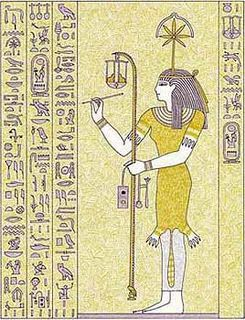

# Seshat - Code Reviewer Tracker
<p align="center">
  
</p>


> Seshat was the ancient Egyptian goddess of wisdom, knowledge and writing.   *by [Wikipedia]([https://en.wikipedia.org/wiki/Seshat](https://en.wikipedia.org/wiki/Seshat))*


### Install

```
pip install -e .
```

### Test

using tox

```shell
tox
```

using pytest

```shell
pytest -s --cov=seshat/reviewer --cov-report=term-missing
```


